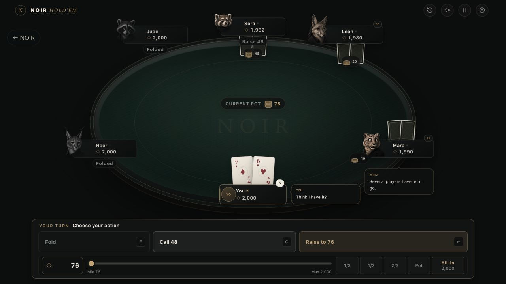
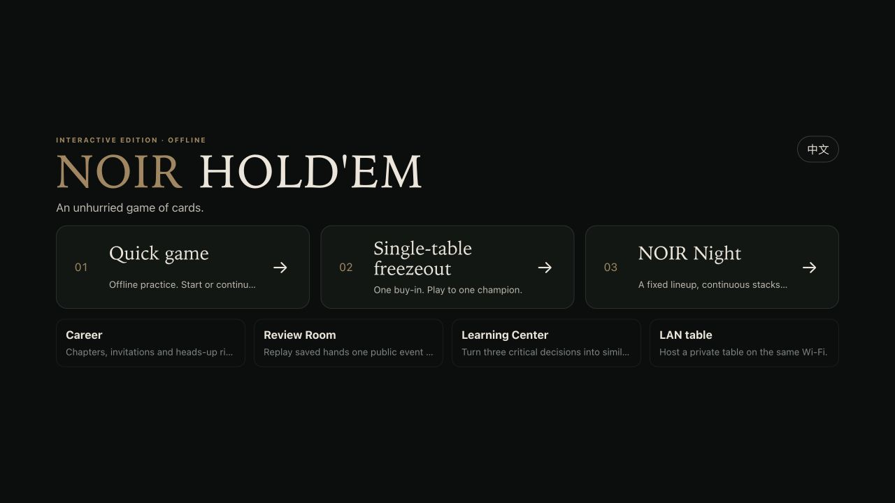

# NOIR HOLD’EM · Interactive Edition 1.0

**Pull up a chair. Eight animal opponents have something to say.**

[**Download for Mac · 159 MB**](https://github.com/Jwxxc/noir-holdem/releases/download/interactive-v1.0/NOIR-HOLDEM-Interactive-1.0-macOS-arm64.zip) · [Release & installation guide](https://github.com/Jwxxc/noir-holdem/releases/tag/interactive-v1.0) · [Share feedback](https://github.com/Jwxxc/noir-holdem/issues/new/choose)

**Apple Silicon Mac · macOS 12+ · English by default · Simplified Chinese available**

Offline single-player. No account required. No real-money features.



## A little conversation between hands

NOIR HOLD’EM is a Texas Hold’em game with a dark, gold-accented table and eight animal characters with distinct personalities. Click a portrait to compliment an opponent, challenge them, or keep them guessing. They respond to what happens at the table, with expressions that change as they think, face a big bet, win a pot, or lose one.

Play a quick game, settle into a longer night session, or try a freezeout tournament. Afterwards, revisit key hands and explore a different decision in a separate practice branch.

Give it a few hands. I’d love to hear which opponent gave you trouble, which exchange made you smile, and what could feel better.

## What you can try

- **Talk across the table.** Choose from six quick phrases addressed to one AI opponent or the whole table. The eight characters share a library of 568 bilingual dialogue lines, selected according to public events and recent conversation.
- **Watch the reactions.** Expressive portraits, card and chip animations, showdown effects, and sound bring the table to life.
- **Find your pace.** Eight characters, four AI difficulty levels, quick games, night sessions, and single-table freezeout tournaments.
- **Revisit your decisions.** Night reports, hand review, and separate practice branches let you look back at key moments.
- **Bring friends.** Host a 2–6 player table on a Mac, with people and AI mixed together. Friends on the same Wi-Fi can join through a modern phone or desktop browser.
- **Play in English or Simplified Chinese.** Switch languages from the title screen or in-game settings.

Table talk uses local dialogue selections, rather than free-text chat. Reactions are part of the social experience and do not reveal an opponent’s hidden cards.

## Download and install

1. Download **[NOIR-HOLDEM-Interactive-1.0-macOS-arm64.zip](https://github.com/Jwxxc/noir-holdem/releases/download/interactive-v1.0/NOIR-HOLDEM-Interactive-1.0-macOS-arm64.zip)**.
2. Unzip it and drag **NOIR HOLD'EM Interactive 1.0.app** into **Applications**.
3. Open the app. No Node.js, Python, or other developer tools are needed.
4. **New installations open in English.** Use the language button in the top-right corner of the title screen to switch to Simplified Chinese, and **EN** to switch back. Your choice is remembered. Updates preserve an existing language preference.

GitHub’s automatically generated **Source code (zip)** and **Source code (tar.gz)** files contain this download page’s materials, not the game. Download the named Mac ZIP above.

### First launch on macOS

This build is not notarized by Apple. If macOS blocks it, first try opening the app, then go to **System Settings → Privacy & Security → Open Anyway** and follow the prompts. On macOS 12, use **System Preferences → Security & Privacy → General**. You do not need to disable system security protections.

If macOS explicitly reports malware, or “Open Anyway” is unavailable, stop and report the message in Issues. See [Apple’s instructions](https://support.apple.com/en-us/102445).

### Supported ways to play

| Mode or platform | Availability |
| --- | --- |
| Mac app | Apple Silicon Macs running macOS 12 or later |
| Single-player vs AI | Works offline |
| Local multiplayer | Same Wi-Fi, hosted by a Mac; guests join in a browser |
| Windows or Intel Mac installers | Not included in this release |
| Browser-only single-player demo | Not included in this release |
| Internet multiplayer with remote friends | Not included in this release |

The download contains no personal saved games from the developer. Your progress is saved on your own Mac.



## Feedback

Use [Issues](https://github.com/Jwxxc/noir-holdem/issues) to share impressions, suggestions, or bugs. For a bug report, please include your Mac chip, macOS version, game mode, and steps to reproduce it. Avoid including personal information in screenshots.

## About this repository

This repository provides **game downloads, release notes, and player feedback**. It does not include the full development source. The public edition is **Interactive Edition 1.0**; the app’s internal version is **3.2.4 / 3002004**.

Download SHA-256:

```text
3663b3613656787bf7c9cc7ba65069cbf00a27781205d779de2f5c55a3fec2b3
```
