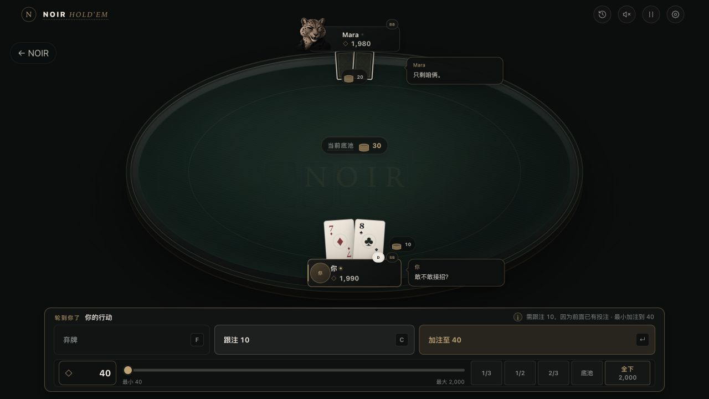
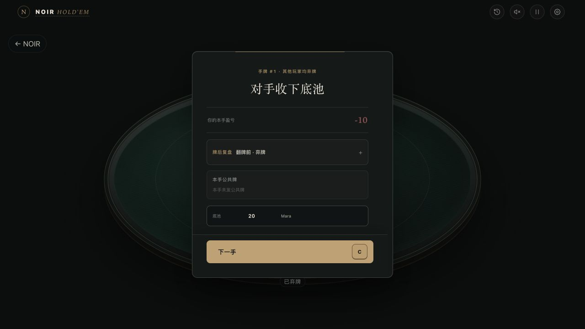

# NOIR HOLD’EM · 交互版 1.0

**和八位有脾气的动物牌手，打一场有来有回的德州扑克。**

[**下载 Mac 版 · 约 159 MB**](https://github.com/Jwxxc/noir-holdem/releases/download/interactive-v1.0/NOIR-HOLDEM-Interactive-1.0-macOS-arm64.zip) · [版本与安装说明](https://github.com/Jwxxc/noir-holdem/releases/tag/interactive-v1.0) · [反馈问题或体验](https://github.com/Jwxxc/noir-holdem/issues/new/choose)

适用于 **苹果 M 系列 Mac · macOS 12 及以上**。单机可离线运行，无需注册账号，没有真钱功能。



## 欢迎坐下打几手

做了一款黑金风格的德州扑克游戏《NOIR HOLD’EM》，这次想把交互版 1.0 分享出来，邀请大家坐下打几手。游戏里有八位性格各异的动物牌手：点头像，可以夸一句“好牌”，也可以试探一句“你猜我有没有”。他们会结合牌桌上发生的事接话，在思考、面对大注、赢池或输池时露出不同表情。想随手玩，可以开快速牌局；想认真较量，可以挑战夜局和淘汰赛，再回看关键手牌。

欢迎来试试，告诉我哪个对手最难缠、哪句回应最好玩，以及哪里还不够顺手。

## 可以体验什么

- **点头像，桌边聊两句。** 六种快捷表达，可以向指定 AI 或全桌发话。八位角色共有 568 条中英对照台词，按公开牌局场景和近期对话选择回应。
- **看得见的角色反应。** 思考、面对大注、赢池和输池会触发表情变化，配合发牌、筹码、摊牌动画和音效，营造牌桌氛围。
- **不同性格，不同难度。** 八位角色、四档 AI 难度；可以开快速牌局，也可以体验夜局和淘汰赛。
- **打完回头看。** 夜局报告、关键手牌复盘和独立练习，方便重看自己的选择。
- **朋友同桌。** Mac 主持局域网牌桌后，同一 Wi-Fi 下的朋友可以用手机或电脑浏览器加入，支持 2–6 人真人与 AI 混合牌桌。
- **中文 / English。** 游戏内可切换语言。

互动采用本地台词选择，不是自由输入聊天。角色回应和表情用于桌边互动，不代表它会泄露自己的暗牌。

## 下载与打开

1. 点击上方 **下载 Mac 版**，或到 [Releases](https://github.com/Jwxxc/noir-holdem/releases/latest) 下载 `NOIR-HOLDEM-Interactive-1.0-macOS-arm64.zip`。
2. 解压，将 **交互版 1.0 — NOIR HOLD'EM.app** 拖入“应用程序”。
3. 双击打开，按游戏内引导开始。无需安装 Node.js、Python 或其他开发工具。

请下载上述游戏 ZIP；GitHub 自动显示的 `Source code (zip)` / `Source code (tar.gz)` 仅包含这个发布仓库的介绍和截图，不包含游戏程序。

### 首次打开被系统拦截

此分享版尚未经过苹果开发者公证。确认下载来自本仓库后，先尝试打开一次，再到 **系统设置 → 隐私与安全 → 仍要打开**，按系统提示确认。macOS 12 的入口为“系统偏好设置 → 安全性与隐私 → 通用”。无需关闭系统安全保护。

若系统明确提示恶意软件，或没有“仍要打开”选项，请停止并在 Issues 反馈提示内容。详细步骤见压缩包中的“先读我：安装与打开”，也可参考 [Apple 官方说明](https://support.apple.com/zh-cn/102445)。

### 支持范围

| 使用方式 | 当前支持 |
| --- | --- |
| 直接安装游戏 | 苹果 M 系列 Mac，macOS 12 或更新系统 |
| 单机对 AI | 可离线运行 |
| 朋友联机 | 同一 Wi-Fi，由 Mac 主持；朋友通过现代浏览器加入 |
| Windows / Intel Mac 原生安装包 | 本次未提供 |
| 点网页链接直接单机试玩 | 本次未提供 |
| 异地互联网联机 | 本次未提供 |

包内不包含作者的个人存档；游戏会在玩家自己的 Mac 上保存进度。



## 反馈

欢迎在 [Issues](https://github.com/Jwxxc/noir-holdem/issues) 留下体验或问题。遇到问题时，请尽量写明 Mac 芯片、macOS 版本、游戏模式和复现步骤；截图请避免带入个人信息。

## 关于这个仓库

这里用于 **成品下载、版本说明和玩家反馈**，不包含完整开发源码。对外版本为 **交互版 1.0**，应用内部版本为 **3.2.3 / 3002003**。

安装包 SHA-256：

```text
b776158fcbfbedcab2fcbf7dd8facb9515d7fac3c83562241ba5b589efa08553
```

---

**English:** NOIR HOLD’EM is an offline Texas Hold’em game with eight animal characters, local table talk, expressive portraits, four AI difficulty levels, quick games, night sessions, tournaments, and hand review. Chinese and English are available in-game. This release supports Apple Silicon Macs running macOS 12 or later. It has no real-money features. Same-Wi-Fi multiplayer is available with a Mac host; a public browser demo and internet multiplayer are not included. The app is not Apple-notarized, so macOS may require “Open Anyway” on first launch.
